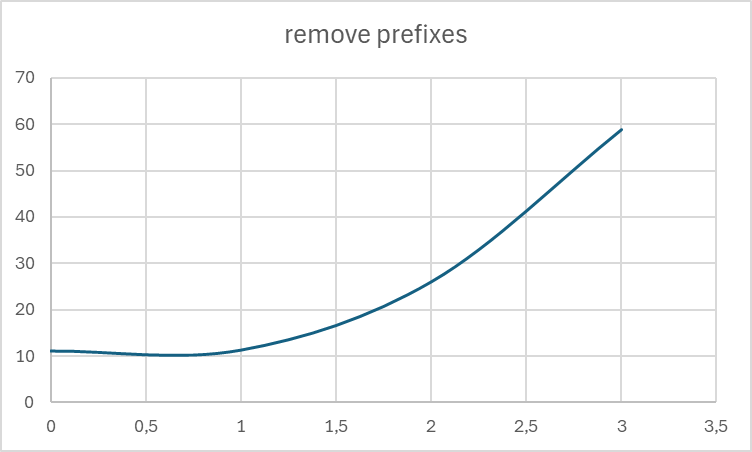

# removing infixes

| infixes | time |
|---------|------|
| 17      | 58,9 |
| 16      | 27,9 |   
| 15      | 10,9 |
| 14      | 6,4  |
| 13      | 3    |
| 12      | 1,4  | 

# removing prefixes

| infixes | time |
|---------|------|
| 3       | 58,9 |
| 2       | 26.1 |   
| 1       | 11.4 |
| 0       | 11.2 |

0 or 1 prefix is the same

 

# error sorting

When too many backtracking leading to EOS occur it generates a lot (19_922_944) of errors.
then we try to sort them by position (RecursiveDescentSyntaxParser.SafeParse #105)
It is really slow.